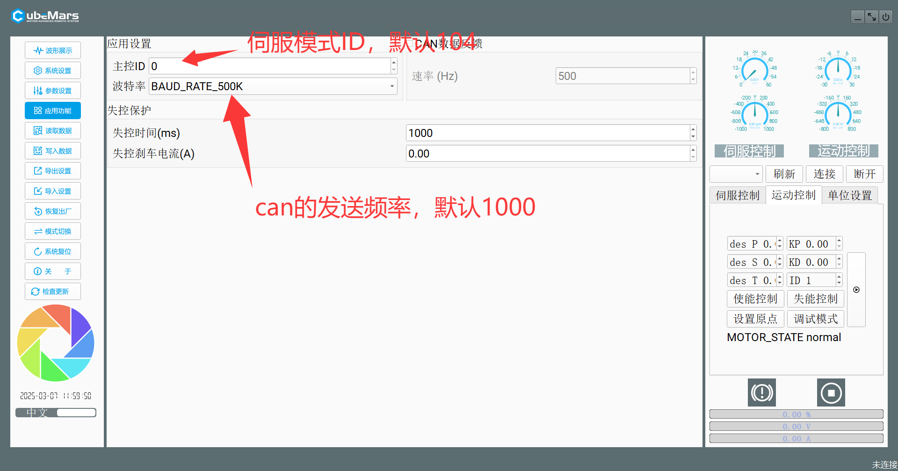
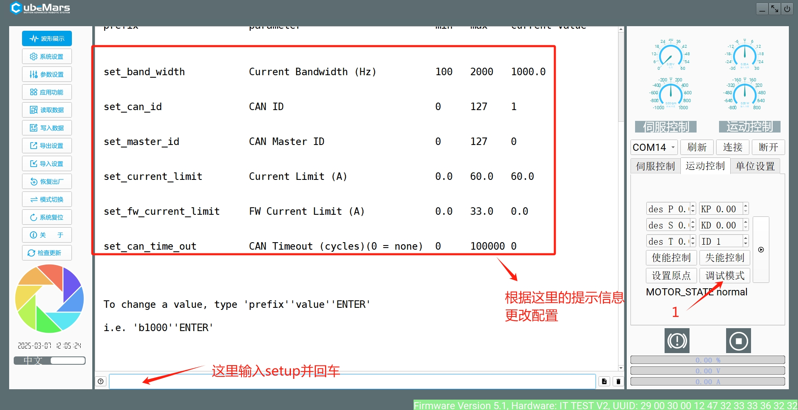

# 用户手册

## 伺服模式 （角度为角度制）
伺服模式下，推荐使用位置速度模式。
  
位置速度模式爆发力不如位置模式（速度与加速度固定），整体呈一个三角波或者梯形波加减速（取决于加速度与速度）  但是售后说尽量避免用位置模式（它是以最高扭矩的形式转动）。

## MIT模式（角度为弧度制）
使用MIT模式时，必须先进入MIT控制模式，必须先开电机再开控制板（或者先开板子，再开电机，然后按RST）。
1. 位置MIT模式
位置MIT模式下，Torque,Speed均为0，，POS，KP,KD不得为0(需要调整KPKD去控制角度精准转动)。**kd 不能赋 0，否则会造成电机震荡，甚至失控。**
当POS是随时间变化的连续可导函数时，同时Speed是POS的导数，可实现位置跟踪和速度跟踪，即按照期望速度旋转期望角度。
2. 速度MIT模式
速度MIT模式下，Pos,Torque，KP均为0，KD与SPEED不为0.（**SPEED单位是rad/s**）。KD不宜过大，会引起震荡。
3. 力矩MIT模式
当Pos,Speed,KP,KD均为0，给定Torque 即可实现给定扭矩输出。在该情况下，电机会持续输出一个恒定力矩。但是当电机空转或负载较小时，如果给定Torque 较大，电机会持续加速，直到最大速度，这时也仍然达不到目标力矩Torque。

## 伺服模式与MIT模式与要注意的地方
1. 模式切换只能在上位机中进行。
2. 伺服模式的控制ID与CAN频率配置见下图
MIT配置ID与CAN发送频率模式见下图
3. 使用AK80-8电机前务必观看使用教程视频<https://www.bilibili.com/video/BV1Ge4y1F7zS/?spm_id_from=333.1387.homepage.video_card.click&vd_source=9ae4219441eae225310ea1af88ade4f6>
与相关使用说明<https://www.cubemars.com/cn/article-261-Technical+Support+and+Download.html>
4. 更改配置时，切记先读取数据，再写入数据，如果造成电机故障，最好的办法找客服：

（如果失效，去cubemars公众号看一下，总会有的）
加上面这个人，跟他说我要加***涂源普***（仅限工作日上班时间）
5. 当然你也可以按照cubemars官网（见上）和使用说明书，自己去刷固件和校准电机（变砖头的概率比较大，不过说明书里有抢救办法，可以尝试一下，实在不行还可以找***涂源普***）